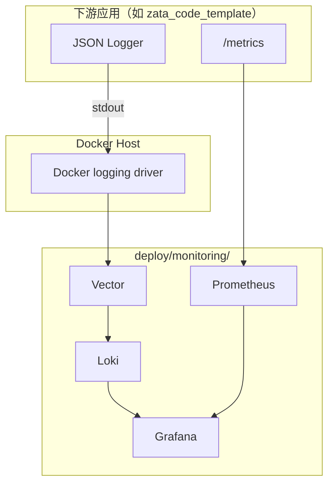

# 监控栈：Vector + Loki + Prometheus + Grafana

## 独立日志与指标服务器

应用容器接入已有平台时，可使用仓库内 `skills/container-observability-onboard/SKILL.md`，覆盖采集器复用、跨机认证、日志及指标验证；该 skill 不负责新建中心平台，也不包含项目特定地址或凭据。

生产部署使用 `deploy/monitoring/docker-compose.yml`，先上传目录中非敏感配置到 `/opt/apps/monitoring`，再执行 `bash prepare-host.sh <根域名>`。服务器须已有 `/opt/traefik` 和 external `traefik` 网络，Grafana 子域名须解析到该机。准备脚本生成随机管理员密码和独立采集密码，分别保存到权限为 600 的 `.env`、`collector.env`，不会打印凭据；已有文件保留。随后校验各组件配置并执行 `docker compose up -d`。不要使用旧的 `--with-monitoring` 自动化路径，其初始化代码尚有默认密码逻辑。

Grafana 禁用匿名访问和自行注册；Loki、Prometheus 没有宿主机发布端口，公网只通过 Traefik 开放 `/loki/api/v1/push` 和 `/api/v1/write`，两个路径均受文件型 Basic Auth 保护，并使用 HTTPS。内部 monitoring/traefik 网络上的容器仍属于可信边界；不应让不可信容器加入这些网络。Docker socket 即使以只读挂载，也具有高权限，采集器须作为受信任服务管理。

应用服务器接入时，把 `collector.compose.yml`、共用的 `vector/vector.yaml` 和受保护的 `collector.env` 上传到独立目录；将后者命名为 `.env`，运行 `docker compose -p observability -f collector.compose.yml up -d`，不重启业务容器。新主机使用唯一 `NODE_NAME` 和独立写入凭据；当前准备脚本只初始化第一个采集身份，新增身份应保留原 users 文件并追加密码哈希，不能重新生成并覆盖已有用户。

Vector 采集容器 stdout/stderr 和主机 CPU、内存、负载、磁盘 I/O 等指标，复用同一配置通过环境变量区分本机与 HTTPS 接收端。未启用文件系统容量采集，不应把磁盘 I/O 面板当作剩余容量；容器内的宿主机网络指标也需单独验证命名空间准确性。应用 `/metrics` 和请求级指标需另行接入。日志非 JSON 也保留原文；需在应用端避免输出敏感值。Vector 每个发送目标有约 256MiB 磁盘缓冲，但不保证历史日志全部补采。

Loki 由 Compactor 执行 7 天保留，清理是异步的；Prometheus 保留 7 天且限制 TSDB 为 10GB，两者都不是整个磁盘的硬容量上限。组件有内存/CPU 上限和自身 Docker 日志轮转。上线验证需覆盖证书、匿名访问拒绝、正确凭据写入、跨主机日志查询、主机指标及 Grafana 仪表盘；容器运行不等于数据链路正常。

本文档描述 zata-ops 提供的单机 VPS 可观测性栈：如何部署、如何与下游应用对接、如何排查常见问题。

## 架构



## 组件

| 组件 | 用途 | 默认端口 |
|---|---|---|
| Vector | 采集 Docker 容器 stdout，解析 JSON，推送 Loki | 8686 |
| Loki | 日志存储与查询 | 3100 |
| Prometheus | 抓取 `/metrics` 和 Vector 指标 | 9090 |
| Grafana | 统一面板，自动 provisioning 数据源 | 3000 |

## 部署

### 随 VPS 一起部署

```bash
zata-ops env provision \
  --host your-server.example.com \
  --user root \
  --profile vps-traefik \
  --acme-email ops@example.com \
  --with-monitoring \
  --monitoring-domain example.com
```

### 手动部署

```bash
cd deploy/monitoring
cp .env.example .env
# 编辑 .env，填写 DOMAIN 和 TRAEFIK_NETWORK
vim .env
docker compose up -d
```

### 本地验证（无 Traefik）

本地联调时可以临时绕过 Traefik，直接暴露 Grafana 端口：

```bash
cd deploy/monitoring
cp .env.example .env
# DOMAIN 可保留 localhost，仅影响 Grafana 的 root_url
docker network create traefik  # 若不存在
# 临时添加端口映射到 docker-compose.override.yml
cat > docker-compose.override.yml <<'EOF'
services:
  grafana:
    ports:
      - "3000:3000"
  prometheus:
    ports:
      - "9090:9090"
  loki:
    ports:
      - "3100:3100"
EOF
docker compose up -d
```

验证完成后删除 `docker-compose.override.yml`，不要提交到版本库。

## 与下游应用对接

下游应用需要满足三个约定：

1. **JSON 日志到 stdout**：应用日志为 JSON，包含 `service_name`、`level`、`message` 等字段。
2. **`/metrics` 端点**：暴露 Prometheus 格式的 RED 指标。
3. **Docker Compose 标签**：服务需带以下标签，供 Vector 分组：
   - `com.docker.compose.project=<project>`
   - `com.docker.compose.service=<service>`

以 `zata_code_template` 为例，其 `config.toml` 已提供 `[observability]` 开关，Docker Compose 服务也已打上所需标签。详见 `zata_code_template/docs/guides/observability.md`。

## 使用 Grafana

部署完成后，Grafana 通过 Traefik 暴露：

```text
https://grafana.<DOMAIN>
```

默认已注册两个数据源：

- **Prometheus**：查询 RED 指标。
- **Loki**：查询应用日志。

默认面板：

- **RED Metrics**：请求量、错误率、P99 延迟。
- **Application Logs**：日志浏览，支持按 `request_id` 过滤。

## Loki 查询示例

```logql
# 查询某个服务的所有日志
{compose_service="backend"}

# 查询具体请求的日志
{compose_service="backend"} |= "abc123"

# 查询 ERROR 级别日志
{compose_service="backend", level="error"}
```

## Prometheus 查询示例

```promql
# 请求速率
sum(rate(http_requests_total[5m])) by (path)

# 错误率
sum(rate(http_requests_total{status=~"5.."}[5m]))
/
sum(rate(http_requests_total[5m]))

# P99 延迟
histogram_quantile(0.99,
  sum by (le, path) (rate(http_request_duration_seconds_bucket[5m]))
)
```

## 常见问题

### Grafana 看不到数据源

检查 `deploy/monitoring/grafana/provisioning/` 是否正确挂载到 `/etc/grafana/provisioning/`，且文件扩展名为 `.yaml`。

### Loki 查不到日志

1. 检查 Vector 日志是否有 parse error。
2. 确认 Vector 正确挂载了 `docker.sock`。
3. 确认应用容器输出到 stdout/stderr；JSON 不是采集前提，但更便于结构化筛选。

### Prometheus 抓不到指标

1. 从监控网络内部访问 `curl http://<backend>:8000/metrics`。
2. 检查 Prometheus targets 页面是否显示 backend 为 UP。

## 成本与保留

- Loki retention 默认 7 天，可在 `loki/local-config.yaml` 调整。
- Prometheus TSDB 保留 7 天、大小上限 10GB，通过 Compose 启动参数调整。
- 当前为单机部署，不做集群高可用。
